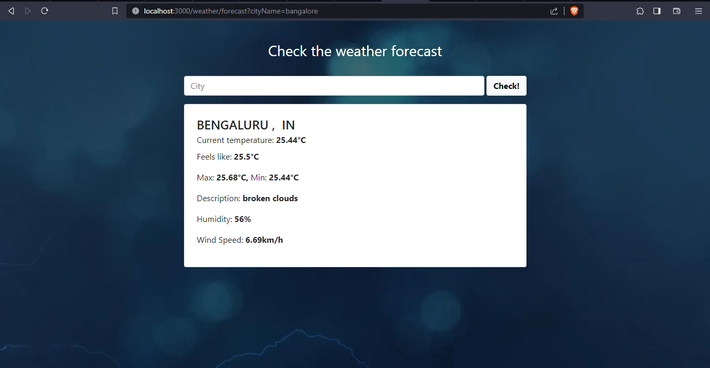

# Weather Forecast Application

## Overview

This is a Spring Boot application that provides weather forecasts using the OpenWeatherMap API. It's built with Spring Boot, Thymeleaf, and incorporates features like MVC, AOP, and logging.

## Features

- **Weather Forecast:** Get the current weather forecast for a specified city.

## Prerequisites

- [Java](https://www.oracle.com/java/technologies/javase-downloads.html) (version 8 or higher)
- [Maven](https://maven.apache.org/download.cgi)

## Demo
    https://weather-m19.up.railway.app/weather/forecast

